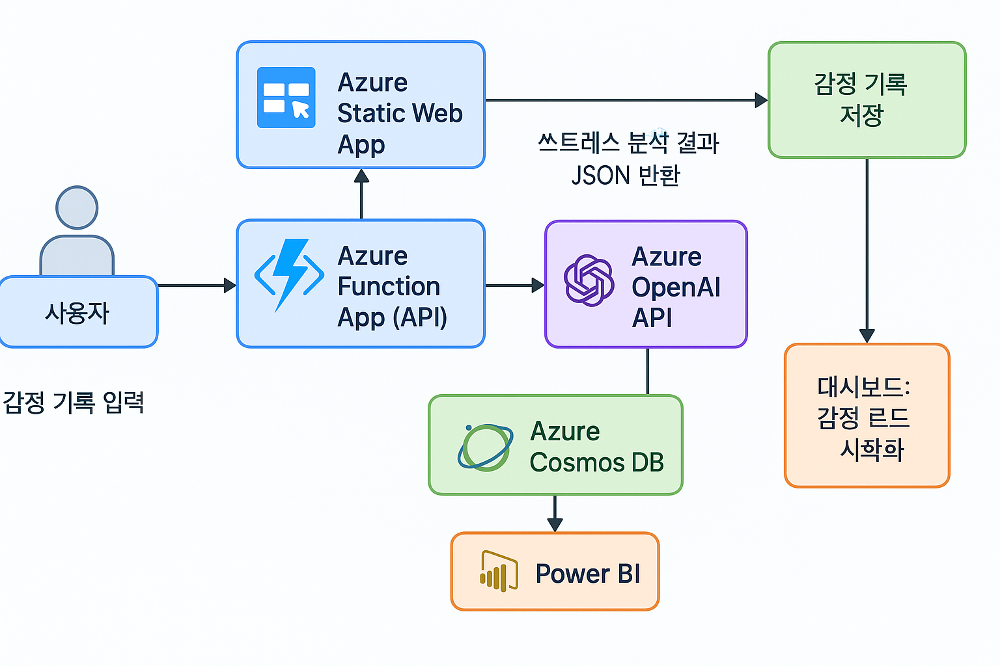

```txt
!! 1주차 아이디어 회의 필요
```



# 💡 프로젝트명
- AI 기반 업무 스트레스 인사이트 시스템

## 🔍 목표 (Objective)
- 업무 중 겪는 감정과 스트레스 상태를 **비정형 텍스트(일지, 회의록, 코멘트 등)**로부터 분석
- 스트레스 변화 추이 시각화 → 개인별 맞춤 인사이트 제공
- 팀 단위로 감정 흐름을 집계해 건강한 조직 문화 조성에 기여

## 📌 주요 기능

|기능명|	설명|
|-----|-----|
|감정 텍스트 입력|	자유형식 일지, 회의 후 감상, 업무 메모 등|
|감정 분석	|Azure OpenAI로 감정/톤/스트레스 신호 분석|
|스트레스 지표화	|감정 점수(Sentiment Score), 키워드 기반 위험도 추출|
|일간/주간 리포트|	개인별 그래프/리포트 생성|
|팀 리더용 대시보드 (선택)	|전체 팀 감정 흐름 집계 (익명 기반)|
|피드백 추천	|AI가 긍정/회복/동기 부여형 피드백 추천|
## 🏗️ 시스템 구성 (Architecture)
```plaintext
[사용자 입력]
    ↓
[Azure Static Web App (React/Next.js)]
    ↓
[Azure Function App API]
    ↓
[Azure OpenAI API]
  - 감정 분석
  - 톤 추출
  - 키워드 요약
    ↓
[Azure Cosmos DB]
  - 사용자별 일지 저장
  - 감정 분석 결과 저장
    ↓
[Power BI 또는 Chart.js 시각화]
GitHub Actions 또는 Azure DevOps로 CI/CD 자동화
```

## 🤖 AI 처리 설계 (Azure OpenAI)
- 예시 프롬프트:
```markdown
입력된 문장을 분석하여 아래 정보를 제공해 주세요.
1. 전반적인 감정 상태 (긍정/부정/중립)
2. 감정의 강도 (0~100점)
3. 스트레스 관련 키워드
4. 가능한 원인 요약
5. 회복에 도움이 될 행동 1가지 추천
```
- 출력 예시:
```json
{
  "sentiment": "부정",
  "intensity": 76,
  "keywords": ["기한 압박", "팀장 피드백", "업무 누적"],
  "summary": "마감 압박과 반복된 피드백으로 인한 심리적 부담",
  "recommendation": "업무 우선순위 정리 및 간단한 산책 제안"
}
```
## 🧪 활용 예시
- 매일 1줄 감정 기록 → 일주일 후 감정 트렌드 리포트
- 업무 피로도가 높아질 때 Slack 알림으로 회복 행동 제안
- 팀 단위로 ‘월간 감정 흐름 차트’ 생성 → 팀 리더에게 인사이트 제공

## 🎯 기대 효과
- 감정의 흐름을 데이터로 시각화해, 자가 진단 + 회복 기회 제공
- 관리자도 구성원 감정 트렌드를 미리 파악하여 리스크 예방
- 실질적인 정서적 복지 도구로 활용 가능

# 👨‍👩‍👧‍👦 팀원 역할 분담 (7명 기준)

|역할	|인원	|상세|
|-----|-----|-----|
|FE 개발자|	2	|정적 페이지 UI, 감정 기록 폼, 대시보드|
|BE/Infra|	2|	Azure Functions, API 처리, DB 연결|
|AI 모델 설계|	1	|OpenAI 프롬프트 디자인 및 튜닝|
|데이터/시각화|	1	|감정 트렌드 분석 및 시각화 구현|
|PM/기획/문서화|	1	|요구사항 정의, 문서화, 회고 정리|
