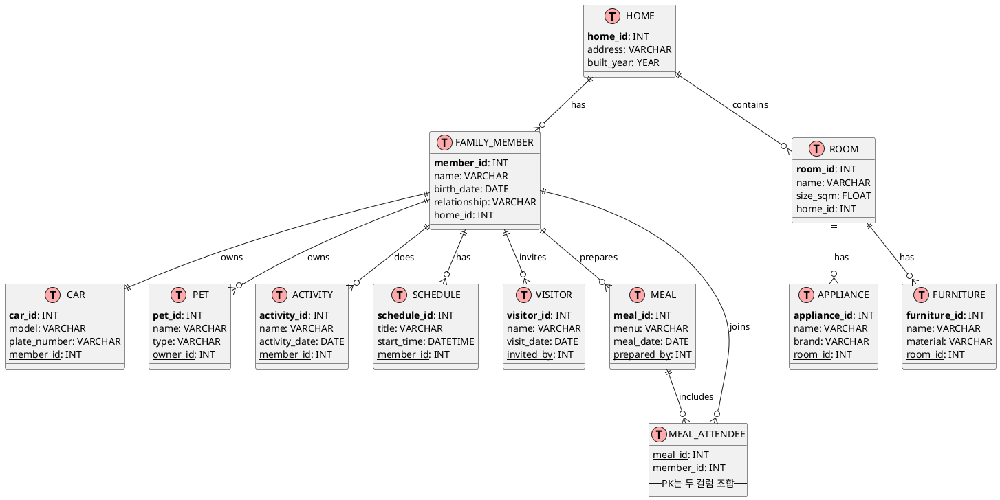

# Workshop

## 예제

### 1. 데이터모델의 관계를 완성하시오.
```
업무를 이해하여 엔터티를 도출하듯이 우리가 가장 잘 알고 있는 집안의 내용물 그리고 행동을 분석하여 가장 적절한 Things, 즉 엔터티를 10개 내외 도출하고 왜 그렇게 도출했는지에 대해서 설명해보도록 하자
도출한 집에 대한 엔터티를 ERgrin에 표현하고 관계를 그려보자.

- 집(HOME)에 대한 엔터티 10개 이상 도출
- 가족 각 구성원은 1대의 자동차를 소유함을 포함함
- 각 엔터티에 대한 속성 3개 이상 도출
- 도출된 엔터티간의 관계 설정(1:1, 1:M, M:M, 슈퍼/서브타입)
- 물리적 속성명(영문명) 및 데이터타입 지정
```

- ✅ 1. 도출된 엔터티 및 설명 (총 11개)

|엔터티명 (한글)	|영문명	|설명|
|---|---|---|
|집|	HOME|	가정이 생활하는 공간. 중심 엔터티|
|가족구성원|	FAMILY_MEMBER|	집에 소속된 사람들|
|방|	ROOM|	집 안에 있는 개별 공간 (거실, 침실 등)|
|가전제품|	APPLIANCE|	집에 설치된 냉장고, TV, 세탁기 등 전자제품|
|가구|	FURNITURE|	침대, 책상, 의자 등 비전자 생활용품|
|자동차|	CAR|	가족 구성원이 소유한 차량|
|애완동물|	PET|	가정에서 기르는 반려동물|
|활동|	ACTIVITY|	청소, 요리, 빨래 등 집 안에서 이루어지는 일상 행동|
|식사|	MEAL|	식사 정보 및 누가 참여했는지 등|
|방문자|	VISITOR|	집에 방문한 외부 인물 정보|
|일정|	SCHEDULE|	가족 구성원의 스케줄이나 집안일 일정 등|

- ✅ 2. 각 엔터티 속성 도출 및 물리적 속성명 (데이터타입)

|엔터티	|속성명(한글)|	영문명 (데이터타입)|
|---|---|---|
|HOME|	집ID|	home_id (INT, PK)|
| |	주소|	address (VARCHAR)|
| |	건축연도|	built_year (YEAR)|
| FAMILY_MEMBER | 구성원ID | member_id (INT, PK) |
|  | 이름 | name (VARCHAR) |
|  | 생년월일 | birth_date (DATE) |
|  | 가족 관계 | relationship (VARCHAR) |
|  | 집ID(FK) | home_id (INT, FK) |
| ROOM | 방ID | room_id (INT, PK) |
| | 이름 | name (VARCHAR) |
| | 방크기 | size_sqm (FLOAT) |
| | 집ID(FK) | home_id (INT, FK) |
| APPLIANCE | 가전ID | appliance_id (INT, PK) |
| | 제품명 | name (VARCHAR) |
| | 브랜드 | brand (VARCHAR) |
| | 설치된방ID(FK) | room_id (INT, FK) |
| FURNITURE | 가구ID | furniture_id (INT, PK) |
| | 이름 | name (VARCHAR) |
| | 재질 | material (VARCHAR) |
| | 설치된방ID(FK) | room_id (INT, FK) |
| CAR | 자동차ID | car_id (INT, PK) |
| | 모델명 | model (VARCHAR) |
| | 번호판 | plate_number (VARCHAR) |
| | 소유자ID(FK) | member_id (INT, FK) |
| PET | 애완동물ID | pet_id (INT, PK) |
| | 이름 | name (VARCHAR) |
| | 종류 | type (VARCHAR) |
| | 주인ID(FK) | owner_id (INT, FK) |
| ACTIVITY | 활동ID | activity_id (INT, PK) |
| | 이름 | name (VARCHAR) |
| | 수행자ID(FK) | member_id (INT, FK) |
| | 수행일 | activity_date (DATE) |
| MEAL | 식사ID | meal_id (INT, PK) |
| | 메뉴 | menu (VARCHAR) |
| | 날짜 | meal_date (DATE) |
| | 준비자ID(FK) | prepared_by (INT, FK) |
| VISITOR | 방문자ID | visitor_id (INT, PK) |
| | 이름 | name (VARCHAR) |
| | 방문일 | visit_date (DATE) |
| | 초대한사람ID(FK) | invited_by (INT, FK) |
| SCHEDULE | 일정ID | schedule_id (INT, PK) |
| | 제목 | title (VARCHAR) |
| | 시작시간 | start_time (DATETIME) |
| | 구성원ID(FK) | member_id (INT, FK) |

- ✅ 3. 관계 설정
  - HOME : FAMILY_MEMBER = 1:M
  - FAMILY_MEMBER : CAR = 1:1
  - HOME : ROOM = 1:M
  - ROOM : APPLIANCE = 1:M
  - ROOM : FURNITURE = 1:M
  - FAMILY_MEMBER : PET = 1:M
  - FAMILY_MEMBER : ACTIVITY = 1:M
  - FAMILY_MEMBER : SCHEDULE = 1:M
  - FAMILY_MEMBER : VISITOR = 1:M (초대한 사람 기준)
  - MEAL : FAMILY_MEMBER (준비자) = M:1
  - FAMILY_MEMBER : MEAL (참석자) = M:N → 중간 테이블 MEAL_ATTENDEE 필요

- ✅ 4. ERD 다이어그램
```mermaid
[HOME]───< [ROOM] >───┬──< [APPLIANCE]  
                      └──< [FURNITURE]

[HOME]───< [FAMILY_MEMBER] ──< [PET]  
                             ├─1:1─ [CAR]  
                             ├──< [ACTIVITY]  
                             ├──< [SCHEDULE]  
                             ├──< [VISITOR]  
                             ├─< [MEAL] (준비자)
                             └──M:N── [MEAL_ATTENDEE] >── [MEAL]

```
- 4-1. ERD 엔터티와 관계, 주요 속성을 계층적이며 정렬된 방식으로 구성
```plantuml
[HOME]
├─ home_id (PK)
├─ address
└─ built_year
    │
    ├──< [ROOM]
    │     ├─ room_id (PK)
    │     ├─ name
    │     ├─ size_sqm
    │     └─ home_id (FK)
    │         ├──< [APPLIANCE]
    │         │     ├─ appliance_id (PK)
    │         │     ├─ name
    │         │     ├─ brand
    │         │     └─ room_id (FK)
    │         └──< [FURNITURE]
    │               ├─ furniture_id (PK)
    │               ├─ name
    │               ├─ material
    │               └─ room_id (FK)
    │
    └──< [FAMILY_MEMBER]
          ├─ member_id (PK)
          ├─ name
          ├─ birth_date
          ├─ relationship
          └─ home_id (FK)
              ├─1:1 [CAR]
              │     ├─ car_id (PK)
              │     ├─ model
              │     ├─ plate_number
              │     └─ member_id (FK)
              │
              ├──< [PET]
              │     ├─ pet_id (PK)
              │     ├─ name
              │     ├─ type
              │     └─ owner_id (FK)
              │
              ├──< [ACTIVITY]
              │     ├─ activity_id (PK)
              │     ├─ name
              │     ├─ activity_date
              │     └─ member_id (FK)
              │
              ├──< [SCHEDULE]
              │     ├─ schedule_id (PK)
              │     ├─ title
              │     ├─ start_time
              │     └─ member_id (FK)
              │
              ├──< [VISITOR]
              │     ├─ visitor_id (PK)
              │     ├─ name
              │     ├─ visit_date
              │     └─ invited_by (FK)
              │
              └──< [MEAL]
                    ├─ meal_id (PK)
                    ├─ menu
                    ├─ meal_date
                    └─ prepared_by (FK)
                        └──M:N [MEAL_ATTENDEE]
                              ├─ meal_id (FK)
                              └─ member_id (FK)

```

### 🔍 요약된 관계 구조
- HOME → ROOM, FAMILY_MEMBER: 1:M
- ROOM → APPLIANCE, FURNITURE: 1:M
- FAMILY_MEMBER → CAR: 1:1
- FAMILY_MEMBER → PET, ACTIVITY, SCHEDULE, VISITOR, MEAL: 1:M
- MEAL ↔ FAMILY_MEMBER: M:N (참석자, MEAL_ATTENDEE 테이블)

### 🏠 Home 시스템 ERD (PlantUML 코드)

