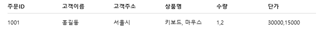

# ✅ 정규화 문제란?
- 주어진 비정규형 테이블(중복, 반복, 다중 값이 포함된 테이블)을 보고, 1NF → 2NF → 3NF 순으로 정규화하여 정상적인 관계형 테이블 구조로 나누는 작업입니다.

## 📘 예제 문제
- 문제: 아래와 같은 고객 주문 테이블을 3NF로 정규화하시오.

## ✅ Step-by-Step 정규화 과정
### 🔹 🥇 1NF (제1정규형)
- 반복되는 값을 분해
- 상품명, 수량, 단가 → 각각의 행으로 분리

| 주문ID | 고객이름 | 고객주소 | 상품명 | 수량 | 단가 |
|---|---|---|---|---|---|
| 1001 | 홍길동 | 서울시 | 키보드 | 1 | 30000 |
| 1001 | 홍길동 | 서울시 | 마우스 | 2 | 15000 |

### 🔹 🥈 2NF (제2정규형)
- 부분 종속 제거 (복합키의 일부에만 의존하는 속성 제거)
- 고객이름, 고객주소는 주문ID만으로 결정되므로 주문 테이블로 분리

- 📄 주문 테이블

| 주문ID | 고객ID |
|--------|--------|
| 1001 | C001 |

- 📄 고객 테이블

| 고객ID | 고객이름 | 고객주소 |
|--------|----------|----------|
| C001 | 홍길동 | 서울시 |

- 📄 주문상세 테이블

| 주문ID | 상품ID | 수량 | 단가 |
|--------|--------|------|------|
| 1001 | P001 | 1 | 30000 |
| 1001 | P002 | 2 | 15000 |

### 🔹 🥉 3NF (제3정규형)
- 이행 종속 제거
- 상품 정보가 상품ID로 결정되므로, 단가를 상품 테이블로 분리

- 📄 상품 테이블

| 상품ID | 상품명 | 단가 |
|--------|--------|------|
| P001 | 키보드 | 30000 |
| P002 | 마우스 | 15000 |

- 📄 주문상세 테이블 (단가 제거)

| 주문ID | 상품ID | 수량 |
|--------|--------|------|
| 1001 | P001 | 1 |
| 1001 | P002 | 2 |

