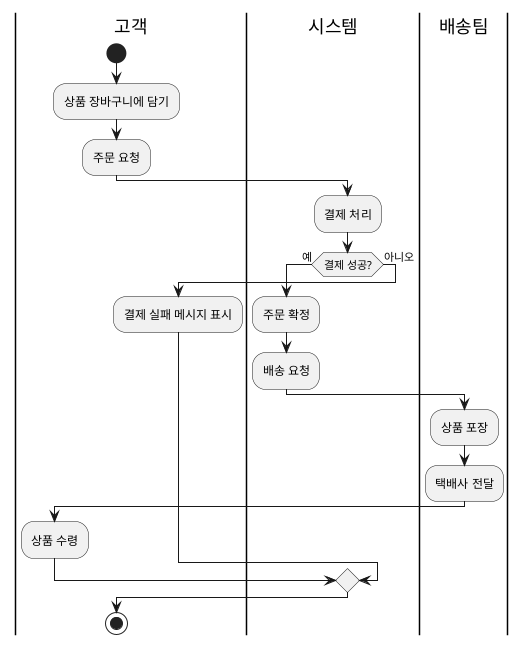
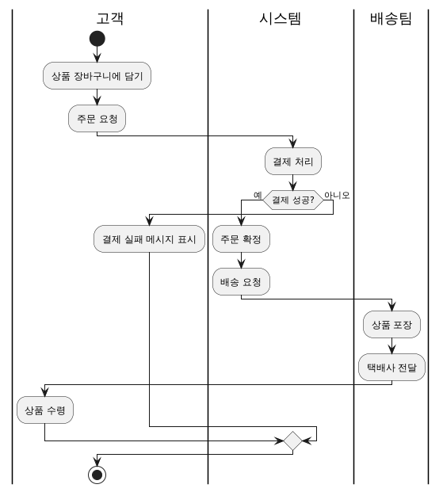

# 🧩 연습 문제: 온라인 쇼핑몰 주문 처리 프로세스
- 문제
```
"온라인 쇼핑몰에서 고객이 상품을 주문하고, 결제하며, 상품을 배송받는 과정을 BPMN 다이어그램으로 모델링하시오."
```


## ✅ 요구사항 시나리오
1. 고객은 상품을 장바구니에 담고 주문을 생성한다.
2. 주문 생성 후 결제를 시도한다.
3. 결제가 성공하면 주문은 "확정"되고, 배송 절차가 시작된다.
4. 결제가 실패하면 고객에게 실패 메시지가 전달된다.
5. 배송팀은 상품을 포장하고, 택배사에 전달한다.
6. 고객이 상품을 수령하면 프로세스가 종료된다.



