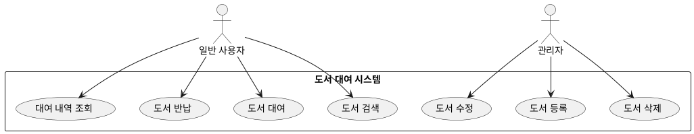
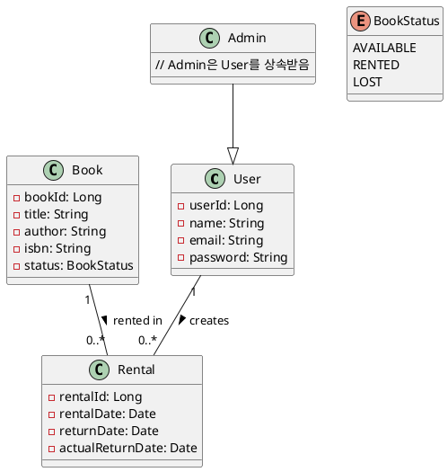

# 🔹 Step 1: 요구사항 도출 (기능 정의)
- 먼저, 이 시스템이 해야 할 핵심 기능부터 정의해야 합니다.
- 제가 아래와 같이 기본 요구사항을 가정해보았습니다:

## ✅ 기능 목록 (초기 가정)
```
사용자는 책을 검색할 수 있다.

사용자는 책을 대여하고 반납할 수 있다.

관리자는 책을 등록/수정/삭제할 수 있다.

사용자는 자신의 대여 내역을 볼 수 있다.
```

## ✅ Step 2: 유스케이스 다이어그램
- 시스템이 어떤 **행위자(Actor)**와 어떤 **기능(Use Case)**으로 구성되는지를 시각화합니다.


## ✅ Step 3: 클래스 다이어그램 (기본 모델)
- 요구사항을 기반으로 아래와 같은 주요 클래스가 도출됩니다:
```
User (일반 사용자)

Admin (관리자 – User를 상속)

Book (도서 정보)

Rental (대여 기록)
```


## ✅ 1. 온라인 도구 사용 (설치 불필요)
- 가장 빠르고 쉬운 방법입니다.

### 🔗 추천 사이트
- PlantUML Online Server (www.plantuml.com/plantuml)

- PlantText (https://www.planttext.com/)

### 📌 사용 방법
- 위 사이트에 접속
- 왼쪽 코드 입력창에 제가 준 PlantUML 코드를 복사해서 붙여넣기
- 자동으로 오른쪽에서 시각화됨

## ✅ 2. VS Code에서 PlantUML 확장 사용
```
🛠 설치 방법
VS Code 설치

확장(Extensions)에서 PlantUML 검색 → 설치

Java 설치 필요 (JDK 8 이상)

Alt + D 로 바로 다이어그램 미리보기 가능

👉 PlantUML 확장과 Graphviz가 함께 설치돼야 렌더링이 제대로 됩니다.
```
## ✅ 3. IntelliJ IDEA 사용자일 경우
Plugin Marketplace에서 PlantUML integration 플러그인 설치

.puml 파일 생성 후 코드 붙여넣기

오른쪽 클릭 → Show Diagram


# ✅ Business Application 모델링 시험 내용 예측

## 🔹 1. 비즈니스 프로세스 모델링 (BPM)
```
BPMN (Business Process Model and Notation) 사용

업무 흐름(Workflow) 분석 및 표현

예시 문제:

“온라인 주문 프로세스를 BPMN으로 표현하시오.”
```
## 🔹 2. 요구사항 도출 및 기능 분해
```
고객 요구사항을 Use Case로 도식화

기능 명세서를 구조화

예시 문제:

“도서 관리 시스템의 기능적 요구사항을 유스케이스 다이어그램으로 표현하시오.”
```
## 🔹 3. 데이터 모델링
```
ERD 작성

정규화 과정 이해

예시 문제:

“고객, 주문, 제품 테이블의 관계를 나타내는 ERD를 설계하시오.”
```
## 🔹 4. 비즈니스 규칙 정의
```
정책/규칙을 정형화

규칙 기반 의사결정 구조

예시 문제:

“대여 연체 시, 자동으로 벌금을 부과하는 비즈니스 규칙을 기술하시오.”
```